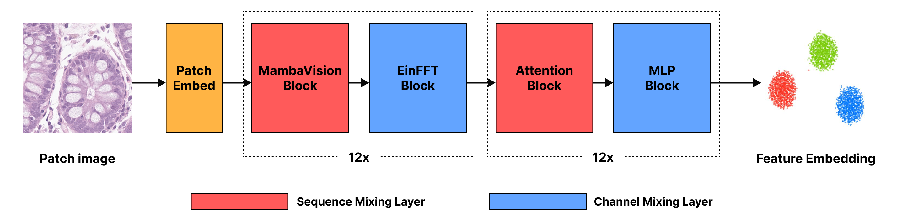

# 🔬 MV<sub>Hybrid</sub>: Hybrid State Space-Vision Transformer for Pathology Foundation Models

<div align="center">

[](https://openreview.net/pdf?id=vd1xqJLW4X)
[](https://openreview.net/forum?id=vd1xqJLW4X)
[](https://www.python.org/downloads/)
[](LICENSE)

**[Won June Cho](mailto:wjcho@deepnoid.com)<sup>1</sup>, [Hongjun Yoon](mailto:hyoon@deepnoid.com)<sup>1</sup>, [Daeky Jeong](mailto:dkjeong@deepnoid.com)<sup>1</sup>, [Hyeongyeol Lim](mailto:hylim@deepnoid.com)<sup>1</sup>, [Yosep Chong](mailto:ychong@catholic.ac.kr)<sup>2</sup>**

<sup>1</sup>AI Research Team 2, AI Research Lab, Deepnoid | <sup>2</sup>Department of Hospital Pathology, The Catholic University of Korea

</div>

---

## 🌟 Highlights

<div align="center">
<table>
<tr>
<td align="center"><b>🎯 57% Higher Correlation</b><br/>than best ViT in LOSO evaluation</td>
<td align="center"><b>💪 43% Better Robustness</b><br/> or smaller performance drop than best ViT</td>
<td align="center"><b>🏆 State-of-the-Art</b><br/> backbone on biomarker prediction tasks</td>
</tr>
</table>
</div>

## 📖 Abstract

Spatial transcriptomics reveals gene expression patterns within tissue context, enabling precision oncology applications such as treatment response prediction, but its high cost and technical complexity limit clinical adoption. Predicting spatial gene expression (biomarkers) from routine histopathology images offers a practical alternative, yet current vision foundation models (VFMs) in pathology based on Vision Transformer (ViT) backbones perform below clinical standards. Given that VFMs are trained on millions of diverse whole slide images, we hypothesize that architectural innovations beyond ViTs may better capture the low-frequency, subtle morphological patterns correlating with molecular phenotypes. By demonstrating that state space models initialized with negative real eigenvalues exhibit strong low-frequency bias, we introduce MV<sub>Hybrid</sub>, a hybrid backbone architecture combining state space models (SSMs) with ViT. We compare five other different backbone architectures for pathology VFMs, all pretrained on identical colorectal cancer datasets using the DINOv2 self-supervised learning method. We evaluate all pretrained models using both random split and leave-one-study-out (LOSO) settings of the same biomarker dataset. In LOSO evaluation, MV<sub>Hybrid</sub> achieves 57% higher correlation than the best-performing ViT and shows 43% smaller performance degradation compared to random split in gene expression prediction, demonstrating superior performance and robustness, respectively. Furthermore, MV<sub>Hybrid</sub> shows equal or better downstream performance in classification, patch retrieval, and survival prediction tasks compared to that of ViT, showing its promise as a next-generation pathology VFM backbone.

## 🔑 Key Contributions

1. **First systematic comparison** of multiple VFM backbone architectures (SSM and ViT variants) pretrained and evaluated on identical datasets
2. **Novel hybrid architecture** combining MambaVision's SSM layers with ViT for enhanced low-frequency feature capture
3. **Comprehensive evaluation** on spatial transcriptomics prediction using HEST datasets with both random and LOSO (Leave-One-Study-Out) settings
4. **Superior robustness** demonstrated through 43% smaller performance degradation in distribution shift scenarios

## 🏗️ Architecture

<div align="center">

</div>

MV<sub>Hybrid</sub> architecture features:
- **First 12 layers**: MambaVision blocks (red) with EinFFT channel mixing (blue)
- **Last 12 layers**: Standard Vision Transformer blocks with attention (red) and MLP (blue)
- **Key Innovation**: Negative real eigenvalues in SSM layers provide enhanced low-frequency bias for capturing subtle biological features. Following [Yu et al.'s work](https://openreview.net/pdf?id=wkHcXDv7cv), MV<sub>Hybrid</sub> leverages the mathematical property that SSMs with negative real eigenvalues exhibit stronger low-frequency bias compared to complex eigenvalues:
  - **Complex eigenvalues**: Total variation ~ O(1/(ω₀ - wⱼ))
  - **Negative real eigenvalues**: Total variation ~ O(1/ω₀)
  
  This faster decay at high frequencies allows MV<sub>Hybrid</sub> to better capture subtle morphological patterns associated with molecular phenotypes.

## 📊 Main Results

### 🧬 Biomarker Prediction Performance

**Evaluation Methodology**: All models were evaluated by training Ridge regression on extracted patch embeddings to predict spatial gene expression values. The evaluation uses:
- **HEST-Benchmark**: Patient-wise 4-fold cross-validation with top 50 HVGs
- **HEST-Extended**: Two evaluation settings to assess robustness:
  - **Random Split**: 10-fold cross-validation mixing all study sources
  - **LOSO (Leave-One-Study-Out)**: 8-fold evaluation where each study source is held out as test set
- **Metrics**: Pearson Correlation Coefficient (PCC) for all genes and top-10 genes (PCC-10), Mean Absolute Error (MAE), Mean Squared Error (MSE)

#### HEST-Benchmark Results
<div align="center">

| Model | PCC ↑ | PCC-10 ↑ | MAE ↓ | MSE ↓ |
|-------|--------|----------|-------|-------|
| ViM<sub>EinFFT</sub> | 0.397±0.065 | 0.685±0.069 | 1.896±0.332 | 5.956±1.985 |
| Hydra<sub>EinFFT</sub> | 0.404±0.064 | 0.692±0.067 | 1.879±0.270 | 5.781±1.674 |
| ViT<sub>12</sub> | 0.415±0.055 | 0.720±0.097 | 1.807±0.355 | 5.392±2.064 |
| ViT<sub>24</sub> | 0.365±0.042 | 0.664±0.080 | 1.869±0.285 | 5.822±1.834 |
| Hydra<sub>Hybrid</sub> | 0.415±0.069 | 0.688±0.082 | 1.824±0.386 | 5.618±2.157 |
| **MV<sub>Hybrid</sub>** | **0.460±0.082** | **0.747±0.082** | **1.748±0.265** | **5.011±1.478** |

</div>

#### HEST-Extended HVG Results (n=200)
<div align="center">

| Model | Eval Type | PCC ↑ | PCC-10 ↑ | MSE ↓ | MAE ↓ |
|-------|-----------|--------|----------|-------|-------|
| **MV<sub>Hybrid</sub>** | Random | 0.214±0.122 | 0.564±0.129 | 0.594±0.283 | 0.488±0.120 |
| | LOSO | **0.138±0.102** | **0.386±0.175** | **0.881±0.671** | **0.614±0.281** |
| | Drop | **35.5%** | **31.5%** | **+48.2%** | **+25.9%** |
| ViT<sub>12</sub> (best baseline) | Random | 0.210±0.146 | 0.555±0.143 | 0.593±0.240 | 0.488±0.101 |
| | LOSO | 0.097±0.108 | 0.349±0.174 | 1.003±0.642 | 0.674±0.265 |
| | Drop | 53.7% | 37.2% | +69.2% | +38.1% |

</div>

#### HEST-Extended HMHVG Results (n=200)
<div align="center">

| Model | Eval Type | PCC ↑ | PCC-10 ↑ | MSE ↓ | MAE ↓ |
|-------|-----------|--------|----------|-------|-------|
| **MV<sub>Hybrid</sub>** | Random | 0.393±0.162 | 0.620±0.116 | 4.542±1.454 | 1.776±0.337 |
| | LOSO | **0.212±0.166** | **0.454±0.168** | **5.889±4.161** | **1.957±0.853** |
| | Drop | **46.0%** | **26.8%** | **+29.7%** | **+10.2%** |
| ViT<sub>12</sub> (best baseline) | Random | 0.373±0.212 | 0.605±0.142 | 4.581±1.344 | 1.780±0.293 |
| | LOSO | 0.110±0.203 | 0.377±0.182 | 7.123±5.225 | 2.174±0.923 |
| | Drop | 70.6% | 37.6% | +55.5% | +22.1% |

</div>

> **Key Finding**: MV<sub>Hybrid</sub> demonstrates significantly better robustness to distribution shifts (LOSO evaluation) with the smallest performance degradation across all metrics.

### 🎯 Other Downstream Tasks

Beyond biomarker prediction, MV<sub>Hybrid</sub> shows equal or better performance compared to ViTs across multiple downstream tasks in colorectal cancer:

- **Classification tasks**: MSI/MSS classification, morphology-based classification on MHIST and UniToPatho datasets
- **Zero-shot patch retrieval**: Superior performance on NCT-CRC-100K dataset
- **Survival prediction**: Improved c-index on TCGA-CRC dataset

For detailed results and analysis of these tasks, please refer to our [full paper](https://openreview.net/pdf?id=vd1xqJLW4X).

## 🚀 Getting Started

### Prerequisites
- Python 3.11
- CUDA 12.1 compatible GPU
- SLURM cluster for multi-node training (preferred)

### Installation

```bash
# Clone the repository
git clone https://github.com/chokevin8/MVHybrid.git
cd MVHybrid

# Create conda environment
conda create -n mambavision python==3.11
conda activate mambavision

# Install PyTorch and dependencies
pip install torch==2.4.0 torchvision==0.19.0 torchaudio==2.4.0 xformers --index-url https://download.pytorch.org/whl/cu121
conda install nvidia/label/cuda-12.1.0::cuda-nvcc 

# Install Mamba and other requirements
pip install --no-cache-dir tensorboardX causal-conv1d==1.4.0 mamba-ssm==2.2.2 timm==1.0.9 einops transformers
pip install fvcore submitit omegaconf
```

### Training

The model is trained using DINOv2 self-supervised learning on a SLURM cluster with multi-node multi-GPU (FSDP) setup:

```bash
sbatch dino/Train_MVHybrid_DINOv2_SLURM.sh
```

## 📂 Dataset

### Pretraining Data
- **[HunCRC](https://wiki.cancerimagingarchive.net/pages/viewpage.action?pageId=91357370)**: Digital Pathological Slides from Hungarian Colorectal Cancer Screening
- **[IMP-CRS2024](https://rdm.inesctec.pt/dataset/nis-2023-008)**: IMP Whole-Slide Images of Colorectal Samples 2024

### Spatial Transcriptomics Data for Biomarker Prediction
- **[HEST-1k](https://github.com/mahmoodlab/HEST)**: Human Embedded Spatial Transcriptomics dataset
  - **HEST-Benchmark**: 8 WSI-ST pairs from 4 patients (colorectal samples)
  - **HEST-Extended**: 54 samples from 8 different study sources (COAD, READ, COADREAD)
  - Data includes 10X Visium, VisiumHD, and Xenium spatial transcriptomics paired with H&E WSIs

### Preprocessing
- **WSI patches**: Extracted using [CLAM](https://github.com/mahmoodlab/CLAM)'s patching function with biopsy preset at 256×256 resolution
- **Gene expression**: Normalized using log1p transformation
- **Gene selection**: 
  - HVG (Highly Variable Genes): Top genes with high expression variance across samples
  - HMHVG (High Mean Highly Variable Genes): Genes that are both abundantly expressed and highly variable


## 📝 Citation

If you find this work useful, please cite our paper:

```bibtex
@inproceedings{cho2025mvhybrid,
  title={$MV_{Hybrid}$: Improving Spatial Transcriptomics Prediction with 
         Hybrid State Space-Vision Transformer Backbone in Pathology 
         Vision Foundation Models},
  author={Won June Cho and Hongjun Yoon and Daeky Jeong and 
          Hyeongyeol Lim and Yosep Chong},
  booktitle={MICCAI Workshop on Computational Pathology with 
             Multimodal Data (COMPAYL)},
  year={2025},
  url={https://openreview.net/forum?id=vd1xqJLW4X}
}
```

## 🙏 Acknowledgments

This work builds upon and extends:
- **[DINOv2](https://github.com/facebookresearch/dinov2)**: Original DINOv2 method modified for MV<sub>Hybrid</sub> training. 
- **[MambaVision](https://github.com/NVlabs/MambaVision)**: Original MambaVision architecture modified from hierarchical to isotropic design for DINOv2 compatibility

### Funding
This research was supported by a grant from the Korea Health Technology R&D Project through the Korea Health Industry Development Institute (KHIDI), funded by the Ministry of Health & Welfare, Republic of Korea (grant number: RS-2021-KH113146).

## 📧 Contact

For questions and collaborations, please reach out to:
- Won June Cho: [wjcho@deepnoid.com](mailto:wjcho@deepnoid.com) or [wonjunecho8@gmail.com](mailto:wonjunecho8@gmail.com)

---

